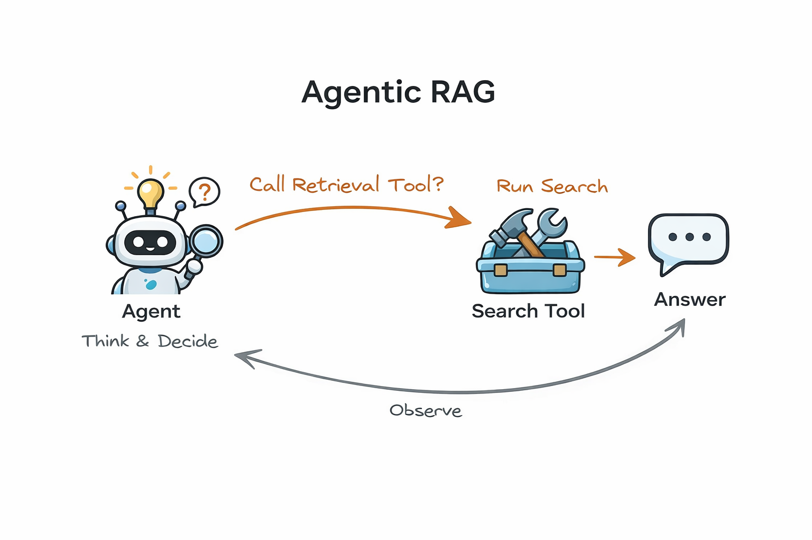
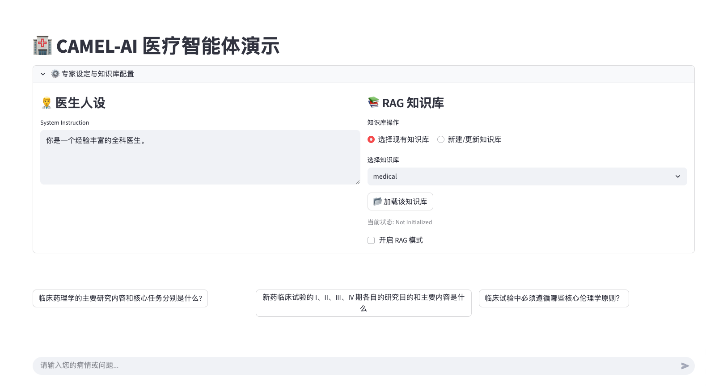
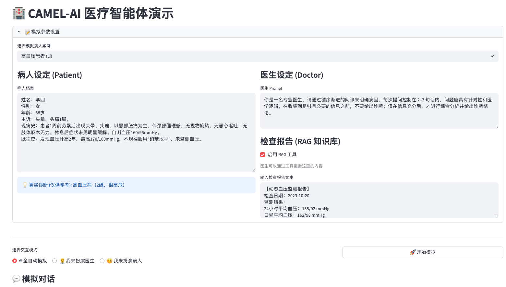

# 🏥 CAMEL-AI 医疗智能体 RAG 实战课程

> 💡 **演示文稿**: 可以从这个网址查看演示文稿内容 https://medical-rag-course.lovable.app

本项目旨在通过一个医疗场景的演示，帮助初学者理解 **智能体 (Agents)** 与 **检索增强生成 (RAG)** 的核心概念，并动手实现两种不同形态的 RAG 系统。

## 📖 目录

- [第一部分：课程核心概念](#第一部分课程核心概念)
  - [1. 什么是大模型智能体 (LLM Agent)?](#1-什么是大模型智能体--llm-agent)
  - [2. 什么是 RAG (Retrieval-Augmented Generation)?](#2-什么是-rag-retrieval-augmented-generation)
  - [3. 本项目展示的两种 RAG 模式](#3-本项目展示的两种-rag-模式)
- [第二部分：项目功能演示](#第二部分项目功能演示)
  - [1. 专家问答模式 (Expert QA)](#1-专家问答模式-expert-qa)
  - [2. 诊疗模拟模式 (Consultation Simulation)](#2-诊疗模拟模式-consultation-simulation)
- [第三部分：任务](#第三部分任务)
  - [项目结构](#项目结构)
  - [你的任务 (Your Tasks)](#你的任务-your-tasks)
  - [测试你的代码](#测试你的代码)
- [第四部分：快速开始 (Quick Start)](#第四部分快速开始-quick-start)
  - [1. 环境配置](#1-环境配置)
  - [2. 运行项目](#2-运行项目)
  - [3. 系统配置](#3-系统配置)
- [项目信息](#项目信息)

---

## 📚 第一部分：课程核心概念

### 1. 什么是大模型智能体 ( LLM Agent)?

简单来说，智能体是拥有“大脑”（大语言模型）的程序，它不仅能陪你聊天，还能使用“工具”（如搜索引擎、数据库、计算器）来解决复杂问题。

### 2. 什么是 RAG (Retrieval-Augmented Generation)?

大语言模型虽然博学，但它无法知道**私有数据**（如你医院的病历）或**最新发生的新闻**。
RAG 技术就像是给了 AI 一本“参考书”。当 AI 回答问题时，它不再只靠“死记硬背”的训练数据，而是先去翻阅我们提供的“参考书”（知识库），找到相关内容后再回答。

### 3. 本项目展示的两种 RAG 模式

本项目设计了两个核心功能模块，分别对应 RAG 的两种不同应用范式：

#### 模式 A："专家问答" -- 标准 RAG

* **场景**: 你问医生一个专业问题，系统自动先去检索相关文档，把资料喂给医生，医生基于资料回答。
* **逻辑**: 用户提问 -> **系统强制检索** -> 注入上下文 -> AI 回答。
* **特点**: 每一句话都会触发检索，适合知识问答。


#### 模式 B："诊疗模拟" -- Agentic RAG

* **场景**: 医生在给病人看病。医生觉得需要看检查报告时，才会主动去“查阅”系统。如果不需要（比如只是问候），就不查。
* **逻辑**: 医生思考 -> **判断是否需要查资料** -> (若需要) 调用检索工具 -> 获得信息 -> 诊断。
* **特点**: 更加灵活，RAG 被封装成一个**工具 (Tool)** 供智能体自主调用。



---

## 🛠️ 第二部分：项目功能演示

### 1. 专家问答模式 (Expert QA)

这是一个基于知识库的问答系统。

* **功能**: 你可以上传医学指南、药品说明书（PDF/TXT），然后向“专家医生”提问。
* **亮点**: 支持配置 RAG 的参数（检索多少条、相似度阈值），让你直观感受参数变化对回答质量的影响。



### 2. 诊疗模拟模式 (Consultation Simulation)

这是一个多智能体协作系统。

* **角色**:
  * **👨‍⚕️ 医生智能体**: 负责问诊和诊断，拥有“查阅病历”的工具权限。
  * **🤒 患者智能体**: 扮演特定病症的病人，根据剧本回答问题。
* **玩法**:
  * **全自动模拟**: 围观两个 AI 互飙演技，看医生如何通过工具查出病因。
  * **角色扮演**: 你可以扮演医生去问诊，或者扮演病人去刁难医生。



---

## 💻 第三部分：任务

### 📂 项目结构

```text
medical_rag_course/
├── app.py                  # 项目入口 (Streamlit 主程序)
├── requirements.txt        # 依赖包列表
├── src/
│   ├── core/
│   │   ├── agents.py       # 智能体逻辑 (Agent Manager)
│   │   ├── rag.py          # [核心任务] RAG 系统核心实现 (Qdrant)
│   │   ├── tools.py        # [核心任务] 医生使用的搜索工具函数
│   │   └── models.py       # 模型工厂类
│   └── ui/                 # 界面相关代码
│       ├── layout.py
│       └── tabs/           # 两个主要标签页的 UI 实现
|-- 临床病理学.txt           # 来自于MedQA数据集的语料 (https://github.com/jind11/MedQA)
```

### 🎯 你的任务 (Your Tasks)

你需要补全 `src/core/` 目录下的关键代码：

1. **作业 1 (src/core/rag.py)**: 实现 `build_retriever_from_files`
   * 目标：初始化向量数据库，并将上传的文件切片、向量化存储。
2. **作业 2 (src/core/rag.py)**: 实现 `get_retrieval_results`
   * 目标：编写查询逻辑，从向量库中检索最相似的文档片段。
3. **作业 3 (src/core/tools.py)**: 实现 `search_medical_records`
   * 目标：将 RAG 检索功能封装成一个 Function Tool，供医生智能体在诊疗模式中调用。

### 🧪 测试你的代码

完成每个任务后，你可以运行对应的测试来验证实现是否正确：

```bash
# 测试任务 1: RAG 构建
python tests/test_task1_rag_build.py

# 测试任务 2: RAG 检索
python tests/test_task2_rag_retrieve.py

# 测试任务 3: 工具函数
python tests/test_task3_tool.py

# 或者运行所有测试
python -m unittest discover tests
```

每个测试文件都会验证对应任务的实现是否符合要求。如果测试通过，会显示 ✅ 提示。

---

## 🚀 第四部分：快速开始 (Quick Start)

### 1. 环境配置

```bash
# 1. 克隆项目
git clone <repository_url>
cd medical_rag_course

# 2. 安装 uv
pip install uv

# 3. 创建并激活虚拟环境
uv venv --python 3.11
.venv\Scripts\activate   # Windows
# source .venv/bin/activate  # Mac/Linux

# 4. 安装依赖
uv pip install -r requirements.txt
```

### 2. 运行项目

```bash
streamlit run app.py
```

### 3. 系统配置

启动后，在浏览器左侧边栏填写配置：

1. **Base URL**: 你的模型服务地址 (你可以同样前往阿里百炼平台获取)。
2. **API Key**: 你的 API 密钥。
3. **Model Name**: 模型名称 (如 `qwen-flash`） 。

---

## 项目信息

**设计**: 复旦大学 DISC 实验室
**课程**: 人工智能课程，2025 年秋季学期
